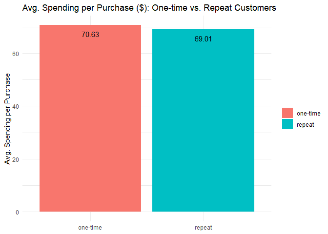
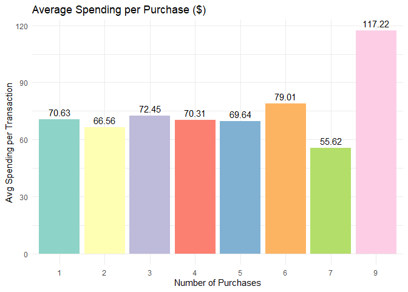
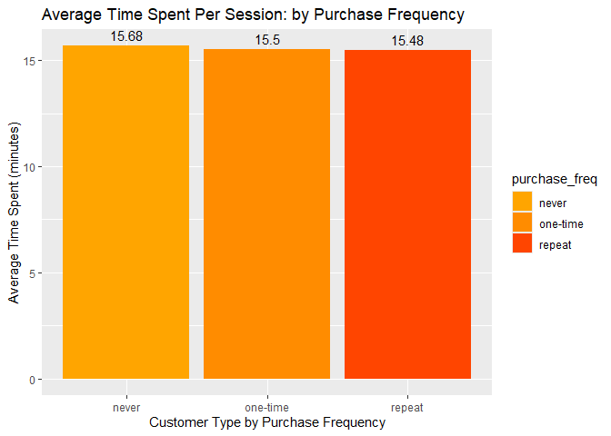
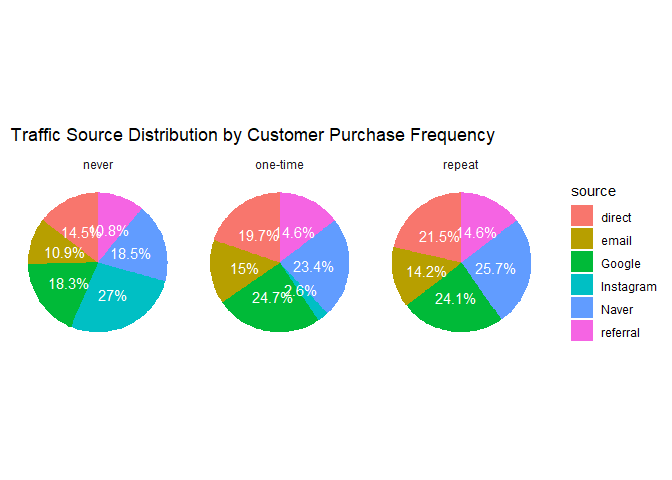
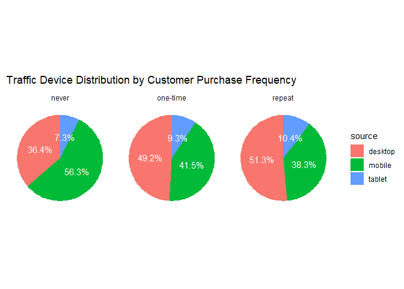
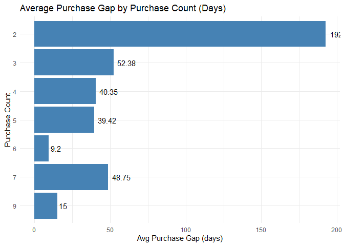

Repeat Customer Analysis
================
Yohan Park
2025-02-02

My youngest sister-in-law has been running an online handicraft store
for more than 2 years since 2023. However, she never looked into the
user data that is provided by the ecommerce platform which her online
store runs on. In the spirit of New Year 2025, she asked me to take a
look at the data.

When I looked at the data, there were three datasets available for
download: **user sessions**, **customer transactions**, and **digital ad
campaigns**.

``` r
sessions <- read.csv("C:/Users/yohan/OneDrive/문서/GitHub/ecommerce_analysis/data/sessions.csv", stringsAsFactors = FALSE)

transactions <- read.csv("C:/Users/yohan/OneDrive/문서/GitHub/ecommerce_analysis/data/transactions.csv", stringsAsFactors = FALSE)

ad_campaigns <- read.csv("C:/Users/yohan/OneDrive/문서/GitHub/ecommerce_analysis/data/ad_campaign.csv", stringsAsFactors = FALSE)
```

``` r
library(dplyr)
library(ggplot2)
library(forcats) # to enable 'fct_rev()' function
```

In particular, my sister-in-law wanted to know if her store has any
**repeat customers**. If so, she wants to know where they’re coming from
and what other characteristics they have so that she can pursue
differentiated marketing efforts.

**Question 01: Do we have repeat customers?**

``` r
# Actually, we have two ways of finding repeat customers. First, we can use our 'sessions' dataset where all user sessions are recorded.  

user_purchase_count_01 <- sessions %>%
  group_by(user_id) %>%
  summarise(
    purchase_count = sum(!is.na(transaction_id))
  ) # We know each transaction_id is unique. However, you don't want to include NAs because it means they didn't make a purchase at all.

str(user_purchase_count_01)
```

    ## tibble [51,646 × 2] (S3: tbl_df/tbl/data.frame)
    ##  $ user_id       : int [1:51646] 1 2 3 4 5 6 7 8 9 10 ...
    ##  $ purchase_count: int [1:51646] 0 0 0 2 0 0 0 0 0 1 ...

``` r
# Second, we use 'transactions' dataset. The dataset includes users who made at least one purchase during the same period.      

user_purchase_count_02 <- transactions %>%
  group_by(user_id) %>%
  summarise(
    purchase_count = n()
  )

str(user_purchase_count_02)
```

    ## tibble [5,056 × 2] (S3: tbl_df/tbl/data.frame)
    ##  $ user_id       : int [1:5056] 4 10 14 22 27 30 31 33 34 36 ...
    ##  $ purchase_count: int [1:5056] 2 1 1 1 2 1 1 2 1 1 ...

``` r
# You can see two tables we just created have different number of rows, but that is because the first table include the number of unique users that didn't make purchase (purchase_count = 0). We can confirm it by checking that the sum of onetime_customers and repeat_customers matches the total number of rows in the second table we created(user_purchase_count_02)

zero__purchase_customers <- sum(user_purchase_count_01$purchase_count == 0)
onetime_customers <- sum(user_purchase_count_01$purchase_count == 1)
repeat_customers <- sum(user_purchase_count_01$purchase_count > 1)

# Now that we know the number of our one-time customers and repeat customers, let's calculate what percentage of our customers are repeat customers.

repeat_customer_percentage <- round((repeat_customers / (onetime_customers + repeat_customers)) * 100, 2)

cat("Repeat Customer Percentage:", repeat_customer_percentage, "%\n")
```

    ## Repeat Customer Percentage: 16.63 %

**Question 02: Are repeat customers spending more per transactions than
one-time customers?**

``` r
# Let's use the 'user_purchase_count' concept again, but this time, we create the table from 'transactions' dataset and with additional columns.

user_purchase_count <- transactions %>%
  group_by(user_id) %>%
  summarise(
    purchase_count = n(),
    total_spending = sum(revenue)
    ) %>%
  mutate(repeat_or_not = ifelse(purchase_count > 1, "repeat", "one-time")) %>%
  ungroup()

avg_spending_repeat_or_not <- user_purchase_count %>%
  group_by(repeat_or_not) %>%
  summarise(
    purchase_count = sum(purchase_count),
    total_spending = sum(total_spending)
  ) %>%
  mutate(
    spending_per_count = total_spending / purchase_count
  ) %>%
  ungroup()

cat("One-time customer Avg. Spending:", avg_spending_repeat_or_not$spending_per_count[1], "$\n")
```

    ## One-time customer Avg. Spending: 70.63345 $

``` r
cat("Repeat customer Avg. Spending:", avg_spending_repeat_or_not$spending_per_count[2], "$\n")
```

    ## Repeat customer Avg. Spending: 69.00825 $

``` r
# Let's visualize the result.

ggplot(avg_spending_repeat_or_not, aes(x=repeat_or_not, y=spending_per_count, fill = repeat_or_not))+
  stat_summary(geom = "bar", fun = mean)+
  stat_summary(geom = "text", fun = mean, aes(label = round(..y.., 2)), vjust = 2)+  # Display mean values
  labs(
    title = "Avg. Spending per Purchase ($): One-time vs. Repeat Customers",
    x = NULL,
    y = "Avg. Spending per Purchase",
    fill = NULL # change legend title
  ) +
  theme_minimal()
```

    ## Warning: The dot-dot notation (`..y..`) was deprecated in ggplot2 3.4.0.
    ## ℹ Please use `after_stat(y)` instead.
    ## This warning is displayed once every 8 hours.
    ## Call `lifecycle::last_lifecycle_warnings()` to see where this warning was
    ## generated.

<!-- -->

**Question 03: Let’s break down the “repeat” customers - what about
spending per purchase by 3, 4, or 5 timers?**

``` r
avg_spending_n_timers <- user_purchase_count %>%
  select(-repeat_or_not) %>%
  group_by(purchase_count) %>%
  summarise(
    number_of_purchase = sum(purchase_count),
    total_spending = sum(total_spending)
  ) %>%
  mutate(
    spending_per_count = total_spending / number_of_purchase
  ) %>%
  arrange(purchase_count) %>%
  ungroup()


ggplot(avg_spending_n_timers, aes(x=factor(purchase_count), y=spending_per_count, fill = factor(purchase_count)))+
  stat_summary(geom = "bar", fun = mean)+
  stat_summary(geom = "text", fun = mean, aes(label = round(..y.., 2)), vjust = -0.5)+
  scale_fill_brewer(palette = "Set3") + 
  labs(
    title = "Average Spending per Purchase ($)",
    x = "Number of Purchases",
    y = "Avg Spending per Transaction",
    fill = "Purchase Count"
  ) +
  theme_minimal() +
  theme(legend.position = "none")
```

<!-- -->

**Questions 04: Do repeat customers spend more time in our store per
session in average?**

``` r
# To answer the question above and more to come, the thing I need to do now is to tag our customers in the new "sessions_freq" dataset with "one-timer", "repeat", and "never" who visited out store but never purchased anything.

sessions_freq <- sessions %>%
  mutate(purchase_freq = "never") # "never" is the default value 

sessions_freq <- sessions_freq %>%
  mutate(
    purchase_freq = case_when(
      user_id %in% user_purchase_count$user_id[user_purchase_count$repeat_or_not == "repeat"] ~ "repeat",
      user_id %in% user_purchase_count$user_id[user_purchase_count$repeat_or_not == "one-time"] ~ "one-time",
      TRUE ~ "never"  # Default value
    )
  )

## Bar chart comparing average session time between "repeat", "one-time", and "never" customers

avg_session_time_by_freq <- sessions_freq %>%
  group_by(purchase_freq) %>%
  summarise(
    avg_session_time = mean(time_spent_per_session), .groups = "drop"
    )

ggplot(avg_session_time_by_freq, aes(x = purchase_freq, y = avg_session_time, fill = purchase_freq))+
  geom_col()+
  geom_text(aes(label = round(avg_session_time, 2)), vjust = -0.5)+
  labs(title = "Average Time Spent Per Session: by Purchase Frequency",
       x = "Customer Type by Purchase Frequency",
       y = "Average Time Spent (minutes)")+
  scale_fill_manual(values = c("repeat"="orangered", "one-time"="darkorange", "never" = "orange"))
```

<!-- -->

**Questions 05: Are customers with different purchase frequencies belong
to different marketing channels or device types?**

``` r
# (1) Pie charts to show medium distribution for "never", "one-time", and "repeat" customers?

medium_distribution <- sessions_freq %>%
  group_by(purchase_freq, medium) %>%
  summarise(count = n(), .groups = "drop") %>%
  group_by(purchase_freq) %>%
  mutate(percentage = count / sum(count)*100,
         label = paste0(round(percentage, 1), "%")) # this entire code has everything I need...

ggplot(medium_distribution, aes(x = "", y = percentage, fill = medium))+
  geom_bar(stat = "identity", width = 1)+
  coord_polar("y", start = 0)+
  geom_text(aes(label = label), position = position_stack(vjust = 0.5), size = 4, color = "white")+
  facet_wrap(~purchase_freq)+
  labs(title = "Traffic Medium Distribution by Customer Purchase Frequency",
       x = NULL, y = NULL, fill = "Medium")+
  theme_minimal()+
  theme(axis.text = element_blank(),
        axis.ticks = element_blank(),
        panel.grid = element_blank()) # removing unnecessary elements
```

<!-- -->

``` r
# (2) Pie charts for Sources

source_distribution <- sessions_freq %>%
  group_by(purchase_freq, source) %>%
  summarise(count = n(), .groups = "drop") %>%
  group_by(purchase_freq) %>%
  mutate(percentage = count / sum(count)*100,
         label = paste0(round(percentage, 1), "%"))

ggplot(source_distribution, aes(x = "", y = percentage, fill = source))+
  geom_bar(stat = "identity", width = 1)+
  coord_polar("y", start = 0)+
  geom_text(aes(label = label), position = position_stack(vjust = 0.5), size = 4, color = "white")+
  facet_wrap(~purchase_freq)+
  labs(title = "Traffic Source Distribution by Customer Purchase Frequency",
       x = NULL, y = NULL, fill = "source")+
  theme_minimal()+
  theme(axis.text = element_blank(),
        axis.ticks = element_blank(),
        panel.grid = element_blank())
```

<!-- -->

``` r
# (3) Pie charts for Devices

device_distribution <- sessions_freq %>%
  group_by(purchase_freq, device) %>%
  summarise(count = n(), .groups = "drop") %>%
  group_by(purchase_freq) %>%
  mutate(percentage = count / sum(count)*100,
         label = paste0(round(percentage, 1), "%"))

ggplot(device_distribution, aes(x = "", y = percentage, fill = device))+
  geom_bar(stat = "identity", width = 1)+
  coord_polar("y", start = 0)+
  geom_text(aes(label = label), position = position_stack(vjust = 0.5), size = 4, color = "white")+
  facet_wrap(~purchase_freq)+
  labs(title = "Traffic Device Distribution by Customer Purchase Frequency",
       x = NULL, y = NULL, fill = "source")+
  theme_minimal()+
  theme(axis.text = element_blank(),
        axis.ticks = element_blank(),
        panel.grid = element_blank())
```

<!-- -->

**Questions 06: On average, how long does it take for a customer to make
a repeat purchase?**

``` r
# To calculate the average time between purchases, you should first filter out for only users with multiple purchases and make sure you date is in Date format.

transactions_btw_purchase <- transactions %>%
  mutate(date = as.Date(date))

avg_purchase_gap <- transactions_btw_purchase %>%
  arrange(user_id, date) %>%
  group_by(user_id) %>%
  filter(n() > 1) %>% # Our "transactions" dataset has recorded all the purchase activities, so user ids here are customers who have made at least one purchase. So, performing "group_by(user_id)" and filtering for "n() > 1" means that we're extracting only our "repeat" customers. 
  mutate(
    time_diff = as.numeric(difftime(date, lag(date), units = "days")) 
  ) %>%
  summarise(
    avg_time_btw_purchase = mean(time_diff, na.rm = TRUE), .groups = "drop"
  )

overall_avg_purchase_gap <- mean(avg_purchase_gap$avg_time_btw_purchase, na.rm = TRUE)

cat("Avg. Time Between Make Purchases (Days):", round(overall_avg_purchase_gap, 2), "\n")
```

    ## Avg. Time Between Make Purchases (Days): 146.71

``` r
## Can we do that again with different groups of repeat customers?

transactions_btw_purchase_by_n <- transactions_btw_purchase %>%
  group_by(user_id) %>%
  mutate(purchase_count = n()) %>% # this is important
  ungroup() %>%
  filter(purchase_count > 1) %>%
  arrange(user_id, date) %>%
  group_by(user_id) %>%
  mutate(
    time_diff = as.numeric(difftime(date, lag(date), units = "days")) 
  ) %>%
  ungroup() %>%
  group_by(purchase_count) %>%
  summarise(
    avg_purchase_gap_by_purchase_count = mean(time_diff, na.rm = TRUE), .groups = "drop"
  )

ggplot(transactions_btw_purchase_by_n, aes(y=fct_rev(factor(purchase_count)), x=avg_purchase_gap_by_purchase_count))+
  geom_bar(stat = "identity", fill = "steelblue")+
  geom_text(aes(label = round(avg_purchase_gap_by_purchase_count, 2)), hjust=-0.2, size = 4)+
  labs(title = "Average Purchase Gap by Purchase Count (Days)",
       x = "Avg Purchase Gap (days)",
       y = "Purchase Count")+
  theme_minimal()
```

<!-- -->
